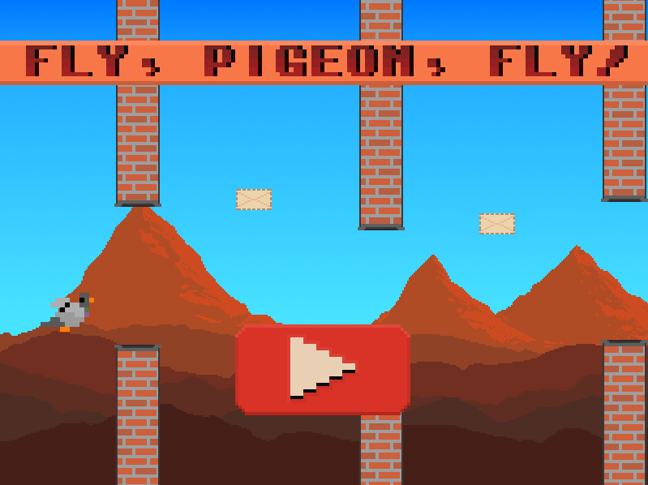
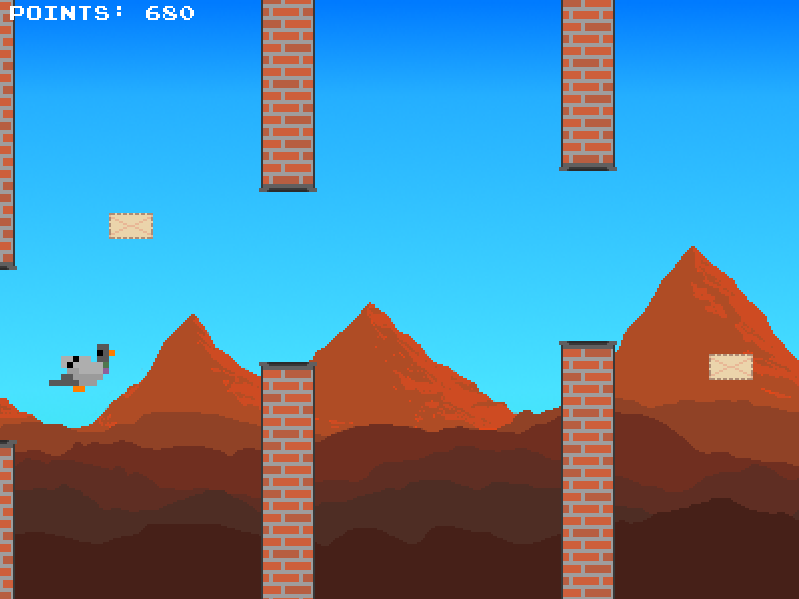
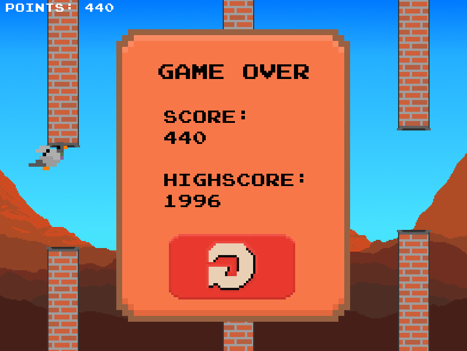

# Fly, Pigeon, Fly!
A side-scroller game, based on SFML(C++) library
 

## Table of contents
* [General info](#general-info)
* [Screenshots](#screenshots)
* [Setup](#setup)
* [How to play](#how-to-play)
* [Status](#status)
* [Sources](#sources)

## General info
Fly, Pigeon, Fly! game was made as a fourth term university project. The main goal was to practise OOP in C++ and some advanced features of this language, such as smart pointers, exceptions mechanism, containers with iterators or RTTI. It is Flappy Bird type game but with added extra funcionality, for example bonuses, to make it a bit more complex and interesting. It was created from scratch, using SFML library.

## Screenshots
Sample screenshots from game:

## Setup
To play you can easily clone GameRelease folder from this repo and just run .exe file. You could also compile source code on your own. All required files are in Game folder, just remember to compile with SFML library linked, I have used Visual Studio 2019 for this project.  

## How to play
The interface is really simple, a player controls the pigeon by mouse clicks, trying to fly bettwen pairs of chimneys without hitting them. The bird automaticly fly right and descends, when the player clicks, the pigeon ascends for some time. The task is to fly as long as possible without hitting obstacles or ground and beat a high score. There are also mails which could be picked by the pigeon and will add extra points. It is also possible to pause the game by pressing P on keyboard. 

## Status
Game is ready to play but will be developed in the future. 

## Sources
- [SFML Library](https://www.sfml-dev.org/) version 2.5.1
Thanks to creators which shared some of used textures or fonts:
- [Background](https://blank-canvas.itch.io/parallax-pixel-art-background-desert)
- [Pigeon](https://pop-shop-packs.itch.io/pigeons-2d-pixel-asset-pack) (modified)
- [Font](https://typodermicfonts.com/proportional-joystix/)
- [Mail](https://vectorpixelstar.itch.io/mega-pixel-art-32x32-px-icons-sprite-sheet) (modified)
- [Buttons](https://sundathree.itch.io/9-color-button-pack) (modified)
- [Title Font](http://arcade.photonstorm.com/) - BattleCircuit(Capcom)
- [Useful SFML tutorial](https://www.youtube.com/watch?v=C06eGdy7C6k)